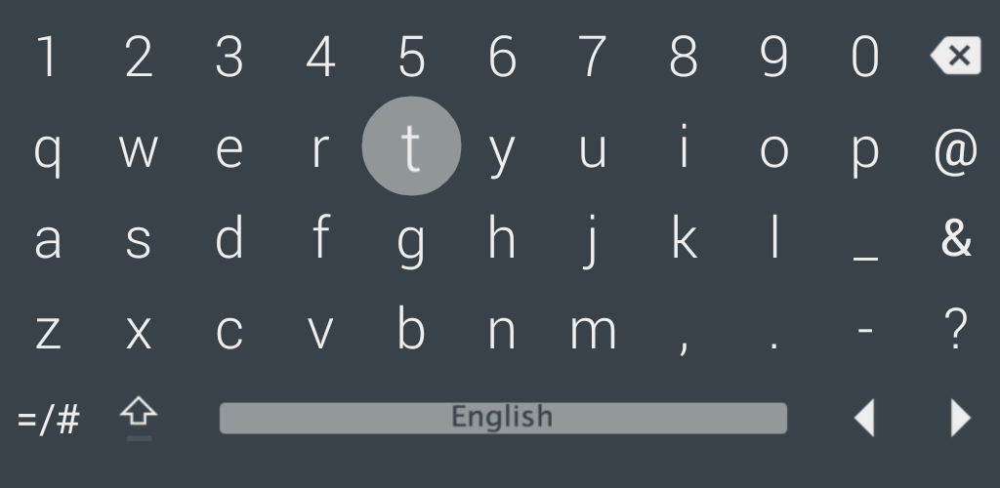
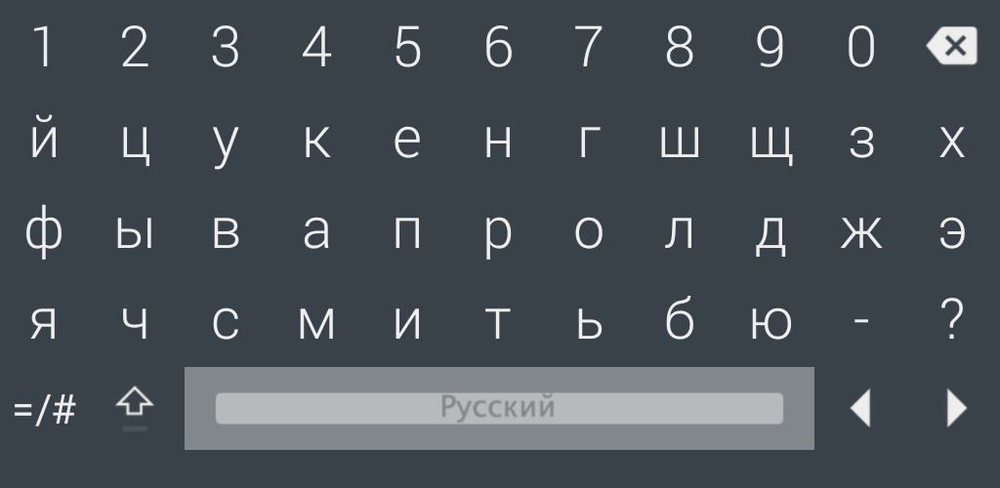
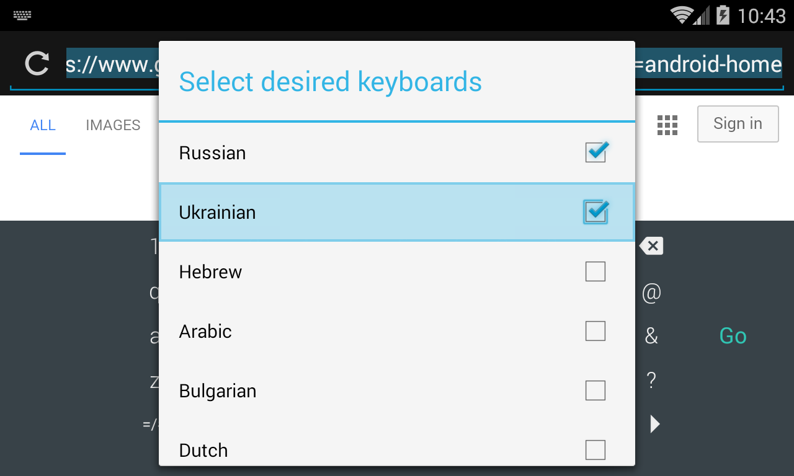
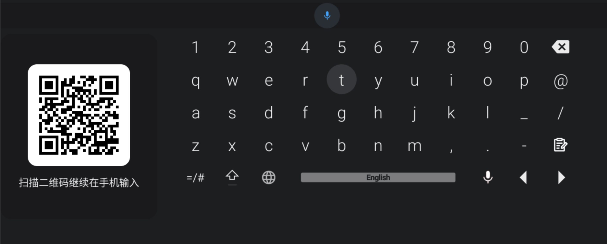

 LeanKeyboard
=========

__LeanKeyboard：面向 Android 机顶盒和电视的屏幕键盘__

这个仓库基于原版 LeanKeyboard，并加入了更适合日常电视输入的增强功能，例如局域网手机接力输入和最近的一些交互改进。

### Language / 语言
 * English: [README.md](./README.md)
 * 简体中文: [README.zh-CN.md](./README.zh-CN.md)

### 功能特性：
 * 为电视屏幕和遥控器操作优化。
 * 支持常见遥控器输入。
 * 支持几十种语言。
 * 不依赖 Google Services。
 * 已包含中文（`zh`）翻译。
 * 支持通过同一局域网中的手机扫码，把文本发送到电视输入框。
 * __无需 root！__

__提示：可以用语言键切换语言，或者长按空格键切换__

__提示：长按语言键可以弹出可用布局选择对话框__

### 这个 fork 的新增内容：
 * 增加本地二维码配对页面，可在手机上继续输入文本并发送到电视。
 * 优化顶部语音按钮在提示栏中的显示和方向键焦点导航行为。
 * 更新远程输入相关默认英文文案，并补充简体中文翻译。

### 截图：
 * __[打开截图区域](#screens)__

### 用手机继续输入：
 1. 在电视上调起 LeanKeyboard，并让光标落在一个可输入的文本框中。
 2. 确保电视和手机连接到同一个局域网。
 3. 使用手机扫描键盘界面里显示的二维码。
 4. 在手机上输入文本并提交，内容会发送到电视当前聚焦的输入框。

如果当前没有可用的局域网地址，LeanKeyboard 会提示二维码配对暂时不可用。

### 安装 LeanKeyboard：
__只用 FireTV，10 分钟内快速安装__
 * <a href="https://github.com/yuliskov/LeanKeyboard/wiki/How-to-Install-LeanKeyKeyboard-on-FireTV">安装 LeanKeyKeyboard（仅需 FireTV）</a>

__通过 ADB 标准安装__
 * 如果你还不熟悉如何通过 ADB 侧载安装应用，可以先看教程，例如 <a href="http://kodi.wiki/view/HOW-TO:Install_Kodi_on_Fire_TV" target="_blank">这篇</a>
 * 从 <a href="https://github.com/yuliskov/LeanKeyboard/releases" target="_blank">LeanKeyKeyboard Releases 页面</a> 下载最新 APK，然后使用 adb 安装：
 * *adb install -r LeanKeyboard.apk*
 * 安装完成后即可使用 :)

### 捐赠：
如果你愿意支持作者的开发工作，可以请他喝杯咖啡 :)
 <!-- * [QIWI (RU, Visa)](https://qiwi.com/n/GUESS025)   -->
 <!-- * [DonatePay (RU, **PayPal**, Visa)](https://new.donatepay.ru/@459197)   -->
 * [**Patreon**](https://www.patreon.com/yuliskov)
 * **PayPal**: firsthash at gmail.com
 * **BTC**: 1JAT5VVWarVBkpVbNDn8UA8HXNdrukuBSx
 * **LTC**: ltc1qgc24eq9jl9cq78qnd5jpqhemkajg9vudwyd8pw
 * **ETH**: 0xe455E21a085ae195a097cd4F456051A9916A5064
 * **ETC**: 0x209eCd33Fa61fA92167595eB3Aea92EE1905c815
 * **XMR**: 48QsMjqfkeW54vkgKyRnjodtYxdmLk6HXfTWPSZoaFPEDpoHDwFUciGCe1QC9VAeGrgGw4PKNAksX9RW7myFqYJQDN5cHGT
 * **BNB**: bnb1amjr7fauftxxyhe4f95280vklctj243k9u55fq
 * **DOGE**: DBnqJwJs2GJBxrCDsi5bXwSmjnz8uGdUpB
 * **eUSDT**: 0xe455e21a085ae195a097cd4f456051a9916a5064

### 评测 / 文章：
 * [__XDA 讨论帖__](https://forum.xda-developers.com/fire-tv/general/guide-change-screen-keyboard-to-leankey-t3527675)

### 更新日志：
 * [在 Releases 页面查看更新记录](https://github.com/yuliskov/LeanKeyboard/releases)

### 贡献者：
 * __[aglt](https://github.com/aglt)__（冰岛语）
 * __[rabin111](https://github.com/rabin111)__（泰语）

### 开发者：
 * __[yuliskov](https://github.com/yuliskov)__（设计与开发）

### Screens:

